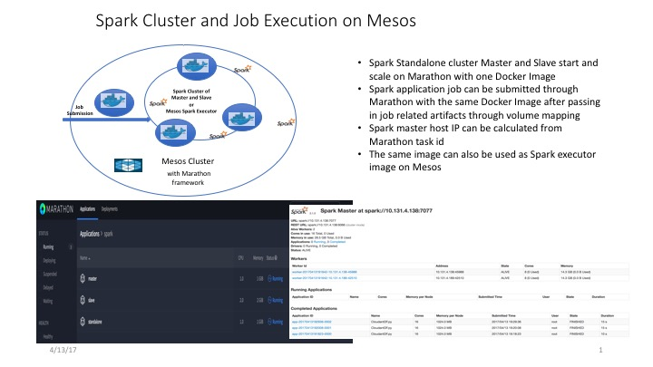

## Spark on Mesos

[Reference Spark running on Mesos](http://spark.apache.org/docs/latest/running-on-mesos.html)

[Reference Spark running as Standalone](http://spark.apache.org/docs/latest/spark-standalone.html)

### Build Docker Image

Reference [Dockerfile](../../docker/Dockerfile) and [pre-built images](https://hub.docker.com/r/yanglei99/spark_mesosphere_mesos/tags/)

#### 2.1

* Built on top of mesosphere/mesos:1.2.0 image
* Install Spark 2.1.0 with Hadoop 2.7
* Install Java 8

#### 2.0

* Built on top of mesosphere/mesos:1.0.0 image
* Install Spark 2..1 with Hadoop 2.7
* Install Java 8

### Start Spark Standalone Cluster with Marathon

#### Start Master

Spark Master job description for [using private network](marathon-master.json), or [using public network](marathon-master-pub.json)

	// Using Private Network
	curl -i -H 'Content-Type: application/json' -d@marathon-master.json $marathonIp:8080/v2/apps

	// Using Public Network
	curl -i -H 'Content-Type: application/json' -d@marathon-master-pub.json $marathonIp:8080/v2/apps

#### Start Slave

Spark Slave job description for [using private network](marathon-slave.json), or [using public network](marathon-slave-pub.json)

	// Using Private Network
	curl -i -H 'Content-Type: application/json' -d@marathon-slave.json $marathonIp:8080/v2/apps

	// Using Public Network
	curl -i -H 'Content-Type: application/json' -d@marathon-slave-pub.json $marathonIp:8080/v2/apps

Note:

* The slave can use Spark-Master's Marathon task name to calculate the Spark master IP address, `SPARK_MASTER_ID=spark/master`. You can also set IP directly by  `SPARK_MASTER_HOST=xxx.xxx.xxx.xxx` or `SPARK_MASTER=spark://xxx.xxx.xxx.xxx:xxxx`

* IP address are calculated with private network by default. You can use `SPARK_USE_PRIVATE_NETWORK=false` to use public network

#### The console

* Spark Master at: `spark://$SPARK_MASTER_HOST:$SPARK_MASTER_PORT`
* Spark Master console start at: `$SPARK_MASTER_HOST:$SPARK_MASTER_WEBUI_PORT`
* Spark Slave console start at: `$SPARK_SLAVE_HOST:$SPARK_WORKER_WEBUI_PORT`

### Submit Spark Job using Marathon

#### using local Spark Master

[Cloudant Python Sample job description](marathon-local.json) 

	curl -i -H 'Content-Type: application/json' -d@marathon-local.json $marathonIp:8080/v2/apps

#### using Spark Standalone Cluster

[Cloudant Python Sample job description](marathon-standalone.json) 

	curl -i -H 'Content-Type: application/json' -d@marathon-standalone.json $marathonIp:8080/v2/apps

Note:

* The spark job is using Spark-Master's Marathon task name to calculate the Spark master IP address, `SPARK_MASTER_ID=spark/master`. You can also use the IP directly by setting `SPARK_MASTER_HOST=xxx.xxx.xxx.xxx` or `SPARK_MASTER=spark://xxx.xxx.xxx.xxx:7077`

#### using Mesos as Cluster Manager with docker executor

[Cloudant Python Sample job description](marathon-mesos-docker.json) 

	curl -i -H 'Content-Type: application/json' -d@marathon-mesos-docker.json $marathonIp:8080/v2/apps

